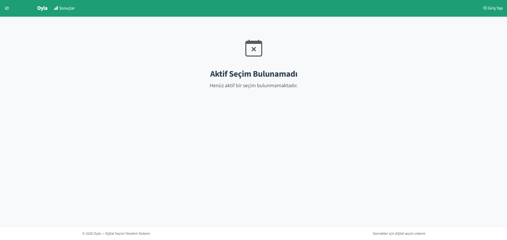
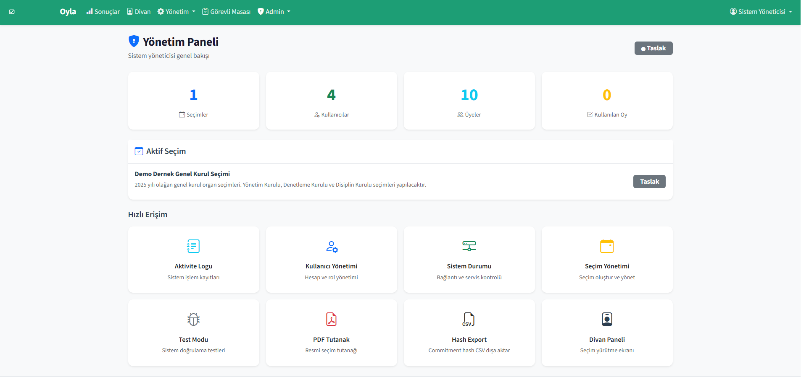
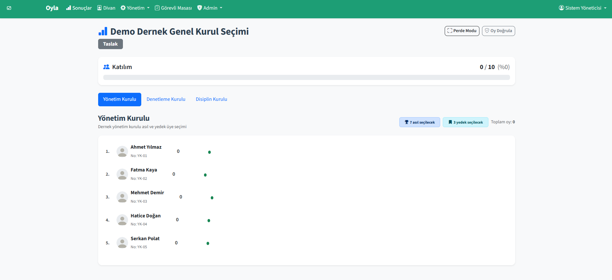
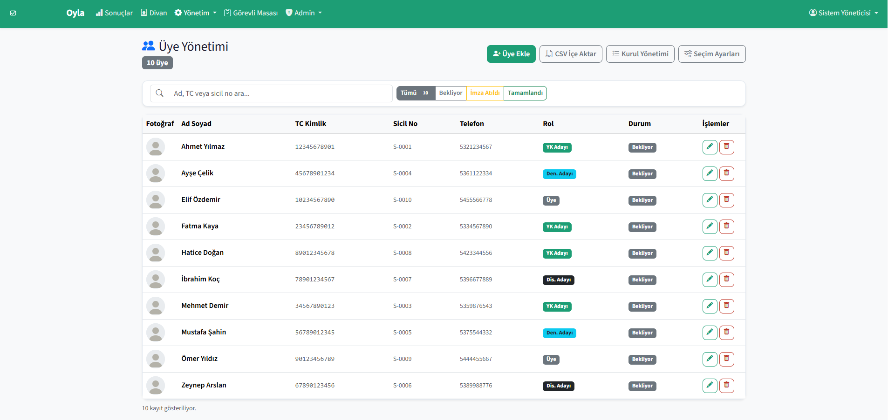
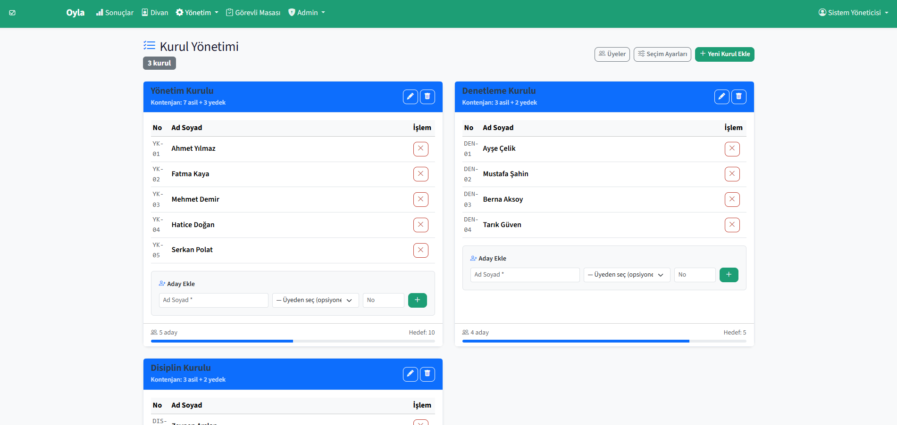
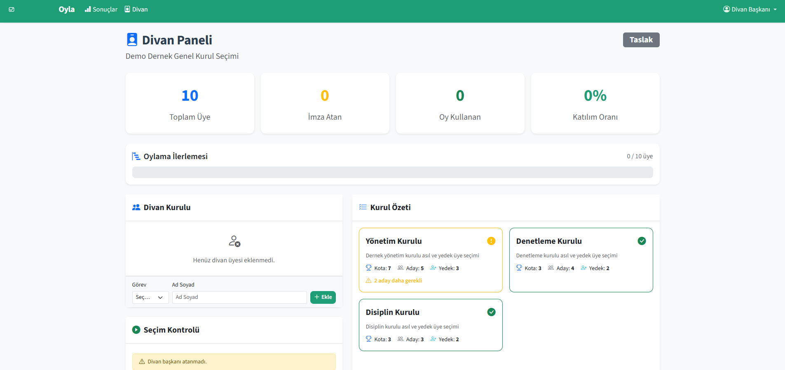
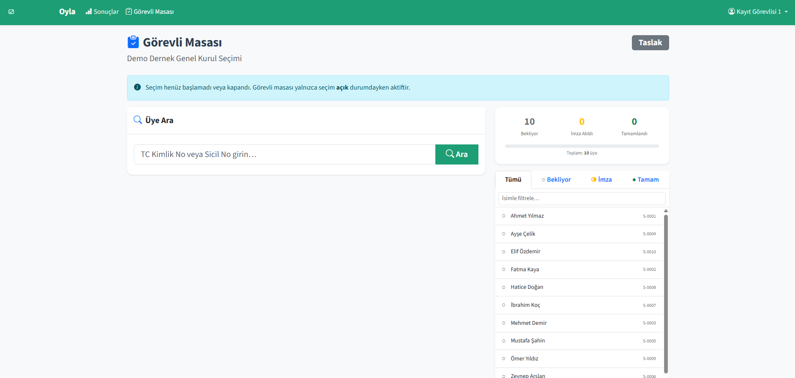
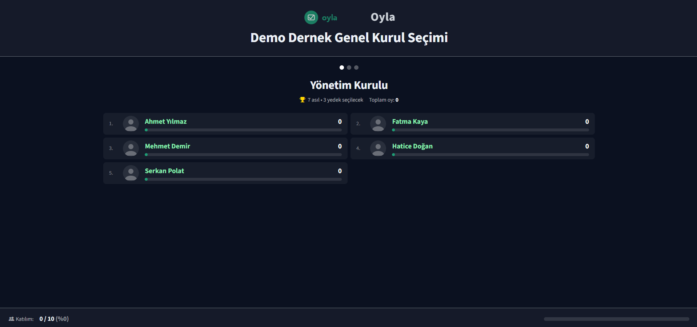

<p align="center">
  
</p>

<p align="center"><strong>Türk dernekleri için güvenli, şeffaf ve kriptografik doğrulamalı dijital seçim yönetim sistemi.</strong></p>

<p align="center">
  <a href="https://opensource.org/licenses/MIT"></a>
  <a href="https://www.php.net/"></a>
  
</p>

---

## Nedir?

Oyla, 5253 sayılı Dernekler Kanunu ile Dernekler Yönetmeliği'ne uygun şekilde tasarlanmış, Türkiye'deki derneklerin genel kurul seçimlerini dijital ortamda güvenli biçimde yönetmesini sağlayan açık kaynak bir yazılımdır.

Kağıt bazlı seçimlerin uzun sürmesi, sayım hataları ve itiraz riskleri göz önünde bulundurularak geliştirilmiştir. Sistem; fiziksel kimlik doğrulamayı, kriptografik oy güvencesini ve anlık sonuç yayınını tek bir platformda birleştirir.

---

## Hangi Sorunları Çözer?

Dernek genel kurullarında seçim yapmış herkes bu durumlardan en az birini yaşamıştır:

**Kağıt oy pusulası karmaşası** — Pusulalar basılır, dağıtılır, toplanır, sayılır. 200 üyeli bir dernekte bu işlem tek kurul için bile 1-2 saat sürebilir. Birden fazla kurul varsa (YK, Denetleme, Disiplin) gece yarısına kadar uzar. Oyla ile tüm oylar dijital ortamda kullanılır, **sayım anında biter**.

**Sayım hataları ve itirazlar** — Elle sayımda pusulalar yanlış okunabilir, sayılar tutmayabilir, mükerrer oy pusulası çıkabilir. İtiraz edildiğinde sayım baştan yapılır. Oyla'da her oy kriptografik hash ile kayıt altındadır; **manipülasyon teknik olarak imkânsızdır**.

**"Kim kime oy verdi?" tedirginliği** — Küçük derneklerde üyeler oylarının gizli kalmadığından endişe duyar. Oyla'da kimlik bilgisi ile oy bilgisi ayrı tablolarda tutulur ve birbirleriyle **hiçbir şekilde eşleştirilemez**. Görevli dahil hiç kimse kimin ne oy verdiğini göremez.

**Hazirun imza karmaşası** — Kim geldi, kim imza attı, kim oy kullandı belli olmaz. Oyla'da her adım kayıt altında: 1. imza (kimlik ibrazı) ve 2. imza (oy kullanma teyidi) ayrı ayrı zaman damgasıyla tutulur.

**Tutanak hazırlama derdi** — Seçim biter, sonuçlar elle tutanağa geçirilir, divan üyeleri imzalar. Oyla, seçim kapandığı anda resmi tutanağı **PDF olarak otomatik üretir** — sonuçlar, katılım oranları, güvenlik özeti ve imza alanları dahil.

**Sonuçların geç açıklanması** — Üyeler sandık başında sayım bitene kadar bekler. Oyla'da **sonuçlar anlık olarak salon ekranına yansır**, oylar geldikçe güncellenir.

---

## Seçim Günü Nasıl İşler?

Aşağıdaki akış, genel kurul günü sistemin baştan sona nasıl kullanıldığını gösterir.

### 1. Seçim Hazırlığı (Genel Kurul Öncesi)

Dernek yöneticisi **Yönetim Paneli**'ne giriş yapar. Üye listesini sisteme yükler — tek tek elle girilebilir ya da mevcut Excel/CSV dosyası toplu olarak aktarılabilir. Her üyenin adı, TC kimlik numarası, telefon numarası ve varsa fotoğrafı sisteme kaydedilir.

Ardından seçim kurulları tanımlanır: Yönetim Kurulu, Denetleme Kurulu, Disiplin Kurulu gibi. Her kurul için kaç kişinin seçileceği (kontenjan) ve kaç yedek üye belirleneceği girilir. Adaylar ilgili kurullara atanır.

### 2. Divan Kurulunun Oluşması

Genel kurul açılışında **Divan Paneli** üzerinden divan başkanı, üyeleri ve kâtip tanımlanır. Divan başkanı sistemde hazirun sayısını (toplam üye, imza atan, oy kullanan) canlı olarak takip edebilir. Tüm kurullar ve adaylar hazır olduğunda "Seçimi Başlat" butonuna basılır.

### 3. Kayıt Masasında İmza ve Token

Salon girişinde görevliler **Görevli Masası** ekranını kullanır. Akış şu şekilde ilerler:

1. Üye masaya gelir, kimliğini gösterir
2. Görevli TC kimlik veya sicil numarasını girer, sistem üyeyi bulur
3. Üye hazirun defterini imzalar — görevli "1. İmza" butonuna basar
4. Sistem üyeye özel tek kullanımlık bir oy bağlantısı üretir
5. Bu bağlantı üyenin telefonuna SMS olarak gönderilir, aynı zamanda ekranda QR kod gösterilir
6. Üye telefonunu açar, bağlantıya tıklar veya QR kodu okuttur
7. **Üye masadan ayrılmadan** oyunu kendi telefonunda kullanır
8. Görevli ekranında "Oy kullanıldı" teyidi otomatik olarak görünür
9. Görevli "2. İmza" butonuna basar — işlem tamamlanır

Görevli hiçbir zaman kimin kime oy verdiğini göremez. Sadece üyenin oy kullanıp kullanmadığını takip eder.

### 4. Oy Kullanma

Üye telefonunda **Oylama Ekranı**'nı açar. Her kurul için aday listesi fotoğraflı olarak gösterilir. Üye, kontenjan kadar aday seçer (örneğin YK için en fazla 7 kişi). Sistem fazla seçim yapılmasını engeller.

Tüm kurullar için seçim yapıldıktan sonra "Oyumu Gönder ve Kilitle" butonuna basılır. Bu işlem geri alınamaz. Oy kaydedildikten sonra üyeye SMS ile bir makbuz kodu gönderilir. Bu kodla daha sonra oyunun sisteme ulaşıp ulaşmadığını doğrulayabilir.

### 5. Canlı Sonuçlar

Salon ekranına yansıtılan **Sonuç Ekranı**, oylar geldikçe anlık olarak güncellenir. Her kurul için adaylar oy sayılarına göre sıralanır. Kontenjan dahilindeki adaylar yeşil çubukla, yedekler açık yeşille gösterilir.

Seçim kapatıldığında ekranda "Resmi Sonuçlar" başlığı belirir ve sayılar sabitlenir.

### 6. Tutanak ve Kapanış

Seçim kapandıktan sonra divan başkanı **PDF Tutanak** oluşturur. Tutanak; divan kurulu, katılım istatistikleri, kurul bazlı sonuçlar, güvenlik özeti ve imza alanlarını içerir. Bu belge, Dernekler Kanunu Madde 23 gereğince il dernekler birimine yapılacak bildirimin ekinde kullanılabilir.

Şeffaflık için tüm oy hash'lerinin listesi CSV olarak indirilebilir. Herhangi bir üye makbuz koduyla oyunun sayılıp sayılmadığını bağımsız olarak doğrulayabilir.

---

## Ekranlar

| # | Ekran | Yol | Kullanıcı | Durum |
|---|---|---|---|---|
| 1 | Divan Paneli | `/divan` | Divan başkanı | Tamamlandı |
| 2 | Yönetim Paneli | `/yonetim` | Dernek yöneticisi | Tamamlandı |
| 3 | Görevli Masası | `/gorevli` | Kayıt görevlisi | Tamamlandı |
| 4 | Sonuç / Perde | `/sonuc` | Salon ekranı (herkese açık) | Tamamlandı |
| 5 | Oylama Ekranı | `/oy/{token}` | Oy kullanan üye | Tamamlandı |
| 6 | Admin Paneli | `/admin` | Sistem yöneticisi | Tamamlandı |

### Ekran Görüntüleri

| Giriş Ekranı | Admin Paneli |
|:---:|:---:|
|  |  |

| Sonuç Ekranı | Üye Yönetimi |
|:---:|:---:|
|  |  |

| Kurul Yönetimi | Divan Paneli |
|:---:|:---:|
|  |  |

| Görevli Masası | Perde Modu (Projeksiyon) |
|:---:|:---:|
|  |  |

---

## Özellikler

**Seçim Yönetimi**
- Divan kurulu tanımlama, seçim başlatma/kapatma
- Hazirun takibi — anlık katılım oranı ve ilerleme çubuğu
- Çoklu kurul desteği (YK, Denetleme, Disiplin vb.) ayrı kota ve yedek tanımıyla

**Üye ve Aday Yönetimi**
- Tek tek veya CSV ile toplu üye ekleme
- Fotoğraf yükleme (UUID ile yeniden adlandırma, MIME doğrulama)
- Aday listesi yönetimi — kurula bağlama, sıralama

**Kayıt Masası (Görevli)**
- 5 adımlı check-in akışı: Kimlik doğrula → 1. İmza → Token üret → Oy bekle → 2. İmza
- QR kod + SMS ile oy bağlantısı gönderimi
- Gerçek zamanlı oy durumu takibi (3 saniye polling)

**Oylama**
- Mobil öncelikli arayüz (360px'den itibaren uyumlu)
- Kurul bazlı aday seçimi, kota zorlama
- Commitment hash ile oy bütünlüğü
- Atomik token burn — oy kaydı ve token iptali tek transaction'da
- SMS ile makbuz kodu gönderimi

**Sonuç Ekranı**
- Canlı bar chart (5 saniye polling)
- Kazananlar yeşil, yedekler açık yeşil, diğerleri gri
- Perde/projeksiyon modu — salon ekranı için tam ekran, karanlık tema, otomatik kurul rotasyonu
- Seçim kapanınca "Resmi Sonuçlar" başlığı

**Admin**
- Kullanıcı yönetimi (görevli/divan hesapları)
- Aktivite logu — tüm işlemler kayıt altında
- Sistem durumu izleme (DB, SMS, disk alanı)
- Hash listesi CSV export — şeffaflık için
- Seçim override (acil durumlar)

**Test Modu**
- 8 sistem kontrolü (DB, SMS, token, hash, çift oy, yetki, sonuç, PDF)
- Sanal seçim simülasyonu — yapılandırılabilir üye sayısı
- Test verileri izole, tek tıkla temizlik

**PDF Tutanak**
- 7 bölümlü resmi seçim tutanağı (TCPDF)
- Divan imza alanları, katılım istatistikleri, kurul bazlı sonuçlar
- Güvenlik özeti, test kaydı (isteğe bağlı)
- Seçim kapanmamışsa "TASLAK" filigranı
- Türkçe karakter desteği (DejaVu Sans)

---

## Güvenlik Mimarisi

```
Token Üretimi     →   UUID v4 + HMAC-SHA256(üye_id + zaman + gizli_anahtar)
Oy Kaydı          →   Commitment hash: SHA256(oy + rastgele_tuz + token)
Anonimlik         →   Kimlik tablosu ile oy tablosu ayrı — çapraz sorgu imkânsız
Çift oy engeli    →   Token burn (tek kullanımlık, 2 saat geçerli)
Doğrulama         →   Üye makbuz koduyla oyunun sayıldığını teyit edebilir
Şeffaflık         →   Seçim kapanınca tüm commitment hash listesi CSV olarak indirilebilir
```

**Kritik kural:** `votes` tablosunda `member_id` sütunu yoktur. `tokens` ve `votes` tabloları hiçbir zaman JOIN yapılmaz. Bu iki kural, oy anonimliğinin temel garantisidir.

---

## Teknoloji

```
Backend:      PHP 8.2+ (saf MVC, framework yok)
Veritabanı:   MariaDB 10.6+
Frontend:     Bootstrap 5.3 + Vanilla JS
Tipografi:    Source Sans 3 + JetBrains Mono
PDF:          TCPDF 6.6
SMS:          Netgsm API (mock modu mevcut)
QR Kod:       endroid/qr-code 5.0
Token:        ramsey/uuid 4.7
Sunucu:       Docker (Nginx + PHP-FPM + MariaDB)
Test:         PHPUnit 10.5
```

---

## Kurulum

```bash
git clone https://github.com/barisozyurt/oyla.git
cd oyla
cp .env.example .env        # Düzenle: DB_PASS, TOKEN_SECRET, APP_SECRET
docker-compose up -d
docker-compose exec php composer install
```

Tarayıcıda `http://localhost` açın. Demo giriş bilgileri:

| Rol | Kullanıcı | Şifre |
|-----|-----------|-------|
| Admin | `admin` | `password` |
| Divan | `divan` | `password` |
| Görevli | `gorevli1` | `password` |

> Demo şifreleri yalnızca geliştirme içindir. Production'da mutlaka değiştirin.

---

## Klasör Yapısı

```
oyla/
├── app/
│   ├── Controllers/    10 controller (Auth, Admin, Divan, Gorevli, Vote, Result, ...)
│   ├── Models/         10 model (Election, Member, Ballot, Vote, Token, ...)
│   ├── Views/          20+ template (6 ekran + layoutlar + hata sayfaları)
│   ├── Core/           MVC çekirdeği (Router, Database, Controller, Model, View)
│   └── Services/       6 servis (Crypto, Token, SMS, QR, PDF, ActivityLog)
├── config/             app.php, database.php, sms.php
├── database/
│   ├── migrations/     10 SQL migration dosyası
│   └── seeds/          Demo veri
├── docker/             Nginx config + PHP Dockerfile
├── public/             index.php + assets (CSS, JS, img) + uploads
└── tests/
    ├── Unit/           Router, RateLimiter, CryptoService, SmsService testleri
    └── Integration/    Anonimlik, güvenlik, oylama akışı testleri
```

---

## Hukuki Uyumluluk

- **5253 sayılı Dernekler Kanunu** — Genel kurul usulü, bildirim yükümlülüğü
- **TMK Md. 73, 80** — Genel kurul zorunluluğu, organ seçimi
- **Dernekler Yönetmeliği Md. 14-15** — Toplantı ve oylama usulü
- **DY Ek Madde-2 (2020)** — Elektronik ortamda işlem ve 2FA

> Üye fiziksel olarak kayıt masasında kimliğini ibraz eder ve imzasını atar. Token bu kişiye özel üretilir. "Şahsen oy kullanma" şartı bu mekanizmayla karşılanır.

---

## Yol Haritası

- [x] Sistem mimarisi ve güvenlik tasarımı
- [x] Docker altyapısı (Nginx + PHP-FPM + MariaDB)
- [x] PHP MVC çekirdeği (Router, Database, Controller, Model, View)
- [x] Veritabanı şeması (10 tablo, migration'lar)
- [x] Kimlik doğrulama (rol bazlı, rate limiting, CSRF)
- [x] Çekirdek servisler (Crypto, Token, SMS, QR, PDF)
- [x] 6 ekranın tamamı (Divan, Yönetim, Görevli, Oylama, Sonuç, Admin)
- [x] Test modu (8 sistem kontrolü, sanal seçim simülasyonu)
- [x] PDF tutanak üretimi
- [x] UI/UX tasarımı (Source Sans 3, Oyla yeşili, mobil uyumlu)
- [ ] Gerçek ortam testi ve hata düzeltmeleri
- [ ] Netgsm canlı SMS entegrasyonu
- [ ] Güvenlik denetimi
- [ ] v1.0 kararlı sürüm

---

## Katkı

Katkıda bulunmak isteyenler [CONTRIBUTING.md](CONTRIBUTING.md) dosyasına göz atabilir.

---

## Lisans

MIT License — Detaylar için [LICENSE](LICENSE) dosyasına bakınız.

---

## İletişim

Geliştirici: **Barış Özyurt** — mirket@mirket.io
Proje: [github.com/barisozyurt/oyla](https://github.com/barisozyurt/oyla)
